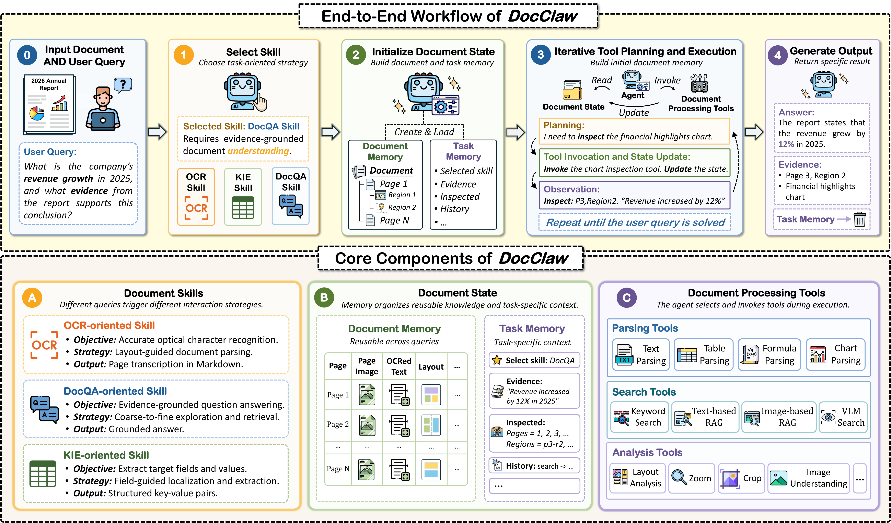

<h1 align="center">DocClaw: A Unified Agentic System for Intelligent Document Processing</h1>

<p align="center">
  <a href="https://arxiv.org/abs/2608.18685">
    
  </a>
</p>

This is the official repository for the paper **"DocClaw: A Unified Agentic System for Intelligent Document Processing"**.

## 🔎 Overview

**DocClaw** is a unified agentic system that formulates intelligent document processing as iterative interactions between an agent and a document. Given a document and a task-specific query, DocClaw selects a document skill, invokes document processing tools, updates structured document state, and produces the requested task output.



## 🗂️ Project Structure

```text
├── docclaw
│   ├── agent
│   │   └── tool
│   ├── config
│   ├── document
│   ├── exporter
│   ├── provider
│   ├── retrieval
│   ├── session
│   └── skills
├── experiment
│   ├── mmlongbench_doc
│   ├── ocrbench_kie
│   ├── ocrbench_v2_kie
│   └── omnidocbench_end2end
├── docclaw.toml
├── README.md
└── requirements.txt
```

## 🚀 Quick Start

### Clone the repository

```bash
git clone https://github.com/docclaw/docclaw.git
cd docclaw
```

### Environment setup

```bash
python3 -m venv .venv
source .venv/bin/activate
pip install -r requirements.txt
```

### Configuration

Set the API key for the provider configured in `docclaw.toml`:

```bash
export GEMINI_API_KEY=...
```

The default configuration uses GPU-backed PaddleOCR/PaddleX components for specialized document parsing. Adjust `docclaw.toml` if you need to change the backbone provider, model, tool backends, or device settings.

### Usage

1. Run DocClaw on a single document:

```bash
python3 -m docclaw \
  --config docclaw.toml \
  --document /path/to/document.pdf \
  --task "Question or task prompt here"
```

2. Start an interactive session:

```bash
python3 -m docclaw chat \
  --config docclaw.toml \
  --document /path/to/document.pdf
```

## 📄 License

This project is released under the [Apache License 2.0](./LICENSE).

## 📝 Citation

If you find DocClaw useful, please cite using this BibTeX:

```bibtex
@article{xiang2026docclaw,
  title={DocClaw: A Unified Agentic System for Intelligent Document Processing},
  author={Siqi Xiang and Zhipeng Xu and Yufei Liu and Junhao Ji and Qing Liu and Zulong Chen and Zhibo Yang and Chunyan Miao and Shijian Lu},
  journal={arXiv preprint arXiv:2608.18685},
  year={2026},
  url={https://arxiv.org/abs/2608.18685}
}
```
